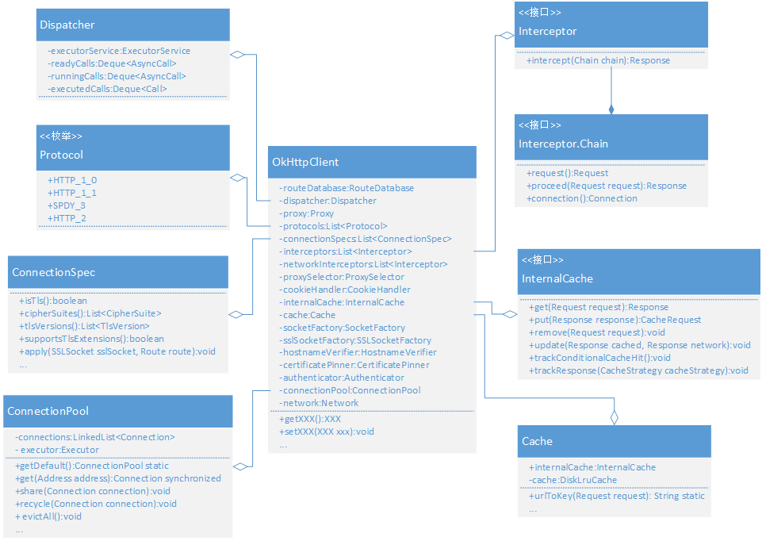
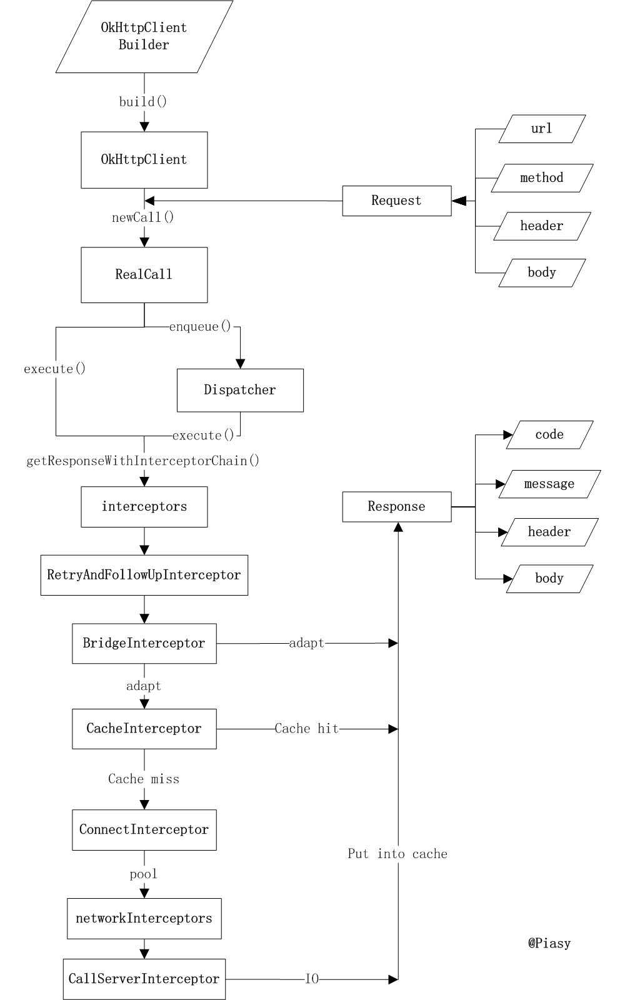

# OkHttp请求网络的流程分析

在日常的开发中，OkHttp+Retrofit已经成为Android开发首选的网络请求框架。在面试中，也是必问的问题之一。今天我们就来对OkHttp的源码做一下解读。

在第一篇文章中，我们先顺蔓摸瓜，跟着方法调用的链路，分析一下okHttp网络请求的流程。后续的文章，再分别对OkHttp的核心类，OkHttpClient/Dispatcher/Interceptor等作进一步解读。

首先上图，看OkHttp的设计类图




然后是OkHttp的请求流程图，先了解一下



## OkHttpClient

先看一下我们日常异步请求的demo代码

```
val client = OkHttpClient.Builder()
          .addNetworkInterceptor(HttpLoggingInterceptor()
          .setLevel(HttpLoggingInterceptor.Level.BODY))
          .build()
val request = Request.Builder()
                .url(url)
                .build()
        client.newCall(request)
        .enqueue(object : Callback {
            override fun onFailure(call: Call?, e: IOException?) {
                error { e?.message }
            }
            override fun onResponse(call: Call?, response: Response?) {
                val result = response?.body()?.string()
                info { result }
            }
        })
```

首先我们使用OkHttpClient.Builder()初始化了一个OkHttpClient的实例，然后使用Request.Builder()构造一个Request实例，然后调用client.newCall(request) .enqueue(callback:Callback?)发出请求。下面我们顺着这个思路，一步一步去拆解。

client.newCall(request)，实际上是使用静态方法创建了一个RealCall

```
 /**
   * Prepares the {@code request} to be executed at some point in the future.
   */
  @Override public Call newCall(Request request) {
    return RealCall.newRealCall(this, request, false /* for web socket */);
  }
```

再看enqueue()方法

```
@Override public void enqueue(Callback responseCallback) {
    synchronized (this) {
    //当前Call实例是否已经被执行过，如果已经执行过，抛出异常
    //因此，OkHttp的每个Call，只能被执行一次
      if (executed) throw new IllegalStateException("Already Executed");
      executed = true;
    }
    //捕获堆栈信息
    captureCallStackTrace();
    //Invoke listener
    eventListener.callStart(this);
    //调用Diapatcher的enqueue方法，注意这里，构造了一个AsyncCall实例
    client.dispatcher().enqueue(new AsyncCall(responseCallback));
  }
```

然后看Dispatcher的enqueue方法

```
  private int maxRequests = 64;//最大并发请求数量
  private int maxRequestsPerHost = 5;//单个Host的最大并发请求数量
  
  /** Ready async calls in the order they'll be run. */
  private final Deque<AsyncCall> readyAsyncCalls = new ArrayDeque<>();

  /** Running asynchronous calls. Includes canceled calls that haven't finished yet. */
  private final Deque<AsyncCall> runningAsyncCalls = new ArrayDeque<>();

  synchronized void enqueue(AsyncCall call) {
  //判断一下，如果当前总的请求数不超过最大并发数/单个Host的最大并发请求数量
  //runningCallsForHost(call)遍历了队列中的所有AsyncCall，找过和当前host相同的AsyncCall的数量
      if (runningAsyncCalls.size() < maxRequests && runningCallsForHost(call) <    maxRequestsPerHost) {
      //加入队列
      runningAsyncCalls.add(call);
      //线程池执行异步请求
      executorService().execute(call);
    } else {
    //加入等待队列，那么问题来了，readyAsyncCalls里面的请求是如何被执行的呢？
    //先把问题抛出来，后面整个流程看完，会水到渠成地get这个问题的答案
      readyAsyncCalls.add(call);
    }
  }
```

Ok,到这一步已经很明朗了，真正的网络请求逻辑应该在AsyncCall的run方法里面，跑不了了。

打开AsyncCall发现，AsyncCall实现了NamedRunnable接口

```
final class AsyncCall extends NamedRunnable
```

```
public abstract class NamedRunnable implements Runnable {
  protected final String name;

  public NamedRunnable(String format, Object... args) {
    this.name = Util.format(format, args);
  }

  @Override public final void run() {
    String oldName = Thread.currentThread().getName();
    Thread.currentThread().setName(name);
    try {
      execute();
    } finally {
      Thread.currentThread().setName(oldName);
    }
  }

  protected abstract void execute();
}
```

再看NamedRunnable，真是名副其实，就是给当前的线程setName，把具体执行逻辑扔到了execute()方法中了，好吧，我们接着回到AsyncCall

```
//构造方法中，super调用父类，设定当前线程的名字
//从Dispatcher的源码中可以看到，ThreadFactory在初始化线程的时候，name都是"OkHttp Dispatcher"
//在这里，会根据请求地址修改线程名字，方便调试
    AsyncCall(Callback responseCallback) {
      super("OkHttp %s", redactedUrl());
      this.responseCallback = responseCallback;
    }
    
    //大招来了
    //一层一层地拨开云雾，终于找到你了
    //这里关注两个方法getResponseWithInterceptorChain()和 client.dispatcher().finished(this)
    @Override protected void execute() {
      boolean signalledCallback = false;
      try {
      //初看源码的时候，以为这里只是拦截请求，并作一些处理，苦于找不到请求的入口，而放弃了。
      //这次终于被我抓住了。
        Response response = getResponseWithInterceptorChain();
        if (retryAndFollowUpInterceptor.isCanceled()) {
          signalledCallback = true;
          responseCallback.onFailure(RealCall.this, new IOException("Canceled"));
        } else {
          signalledCallback = true;
          responseCallback.onResponse(RealCall.this, response);
        }
      } catch (IOException e) {
        if (signalledCallback) {
          // Do not signal the callback twice!
          Platform.get().log(INFO, "Callback failure for " + toLoggableString(), e);
        } else {
          eventListener.callFailed(RealCall.this, e);
          responseCallback.onFailure(RealCall.this, e);
        }
      } finally {
      //上文中我们抛出过一个问题，readyAsyncCalls队列中的AsyncCall是怎么被执行的
      //答案就在这里
        client.dispatcher().finished(this);
      }
    }
  }

```
这里我们先看一下client.dispatcher().finished(this)的实现
```
 /** Used by {@code AsyncCall#run} to signal completion. */
  void finished(AsyncCall call) {
    finished(runningAsyncCalls, call, true);
  }
  
  private <T> void finished(Deque<T> calls, T call, boolean promoteCalls) {
    int runningCallsCount;
    Runnable idleCallback;
    synchronized (this) {
    //移除当前的call
      if (!calls.remove(call)) throw new AssertionError("Call wasn't in-flight!");
      //这里不再展开，只描述一下promoteCalls()的作用
      //迭代器迭代readyAsyncCalls，拿出next的AsyncCall，加入runningAsyncCalls，然后线程池去执行
      if (promoteCalls) promoteCalls();
      runningCallsCount = runningCallsCount();
      idleCallback = this.idleCallback;
    }

    if (runningCallsCount == 0 && idleCallback != null) {
      idleCallback.run();
    }
  }
```

因为finish()是在finally代码块中执行的，也就是说，无论当前的AsyncCall请求成功/失败，都会被移除出队列，然后下一个等待任务进入队列，被执行。

接着回到主线

```
Response response = getResponseWithInterceptorChain();
```

这段代码可谓是精髓所在了，方法实现

```
Response getResponseWithInterceptorChain() throws IOException {
    // Build a full stack of interceptors.
    List<Interceptor> interceptors = new ArrayList<>();
    //client.interceptors()里面是我们在构造OkHttpClient.Builder()对象时，使用addInterceptor添加的拦截器
    interceptors.addAll(client.interceptors());
    //负责失败重试以及重定向
    interceptors.add(retryAndFollowUpInterceptor);
    //负责对用户请求作封装，转换成可以发送到服务器的请求
    //以及对服务器的响应作封装，转换成用户友好的响应
    interceptors.add(new BridgeInterceptor(client.cookieJar()));
    //负责缓存逻辑处理
    interceptors.add(new CacheInterceptor(client.internalCache()));
    //负责和服务器建立连接
    interceptors.add(new ConnectInterceptor(client));
    if (!forWebSocket) {
    //client.interceptors()里面是我们在构造OkHttpClient.Builder()对象时，使用addNetworkInterceptor添加的拦截器
      interceptors.addAll(client.networkInterceptors());
    }
    //负责向服务器发送请求
    interceptors.add(new CallServerInterceptor(forWebSocket));

    Interceptor.Chain chain = new RealInterceptorChain(interceptors, null, null, null, 0,
        originalRequest, this, eventListener, client.connectTimeoutMillis(),
        client.readTimeoutMillis(), client.writeTimeoutMillis());

    return chain.proceed(originalRequest);
  }
```

该方法中，首先把我们自定义添加的拦截器添加到拦截器集合中，然后添加了一系列的拦截器。

[责任链模式](https://zh.wikipedia.org/wiki/%E8%B4%A3%E4%BB%BB%E9%93%BE%E6%A8%A1%E5%BC%8F)在这个 `Interceptor` 链条中得到了很好的实践（感谢 Stay 一语道破，自愧弗如）。

> 它包含了一些命令对象和一系列的处理对象，每一个处理对象决定它能处理哪些命令对象，它也知道如何将它不能处理的命令对象传递给该链中的下一个处理对象。该模式还描述了往该处理链的末尾添加新的处理对象的方法。


## Dispatcher

首先看OkHttpClient，该类的注释说明它是

```
Factory for {@linkplain Call calls}, which can be used to send HTTP requests and read their responses.
OkHttpClient实现了Call.Factory, WebSocket.Factory这两个接口。同时支持HTTP请求和WebSocket请求。
```

```
OkHttpClient()用于创建一个默认参数的Client
而其内部类OkHttpClient.Builder()用于创建一个自定义参数的Client
newBuilder()其实相当于一个深拷贝的概念，拷贝和当前相同配置的一个Client，用于一些特殊的请求。通过阅读源码发现，newBuilder返回的Client和原来的Client拥有相同的参数，包括ConnectPoll和
```

通过阅读源码发现，OkHttp支持 HTTP1.1/HTTP2.0/SPDY，支持TLS1.0-1.3，支持WebSocket

但是默认boolean isTLS = false;是关闭的

```
ConnectionSpec这个类提供了HTTPS连接时支持的cipherSuites
ConnectionSpec提供了三种模式：MODERN_TLS，COMPATIBLE_TLS，CLEARTEXT
```

```
所有Intercept onIntercept回调中的Chain实例，都是RealInterceptorChain的实例，是在RealInterceptorChain.proceed()方法中使用构造方法创建出来的，而且，这里的chain指向的是Interceptors中的下一个Interceptor
这里的处理十分的巧妙
```

```
Cookie类是OkHttp对Cookie的封装，提供的数据类，在使用CookieJar的时候，可以直接把自己Cookie的key-value放入Cookie实例中，然后把实例塞给CookieJar
```

## Interceptors解毒

### RetryAndFollowUpInterceptor

```
This interceptor recovers from failures and follows redirects as necessary.

这个类的源码读的不是很明白，其中有一个关键点：
StreamAllocation是从这里构造出来，然后传递给realInterceptor的
```

